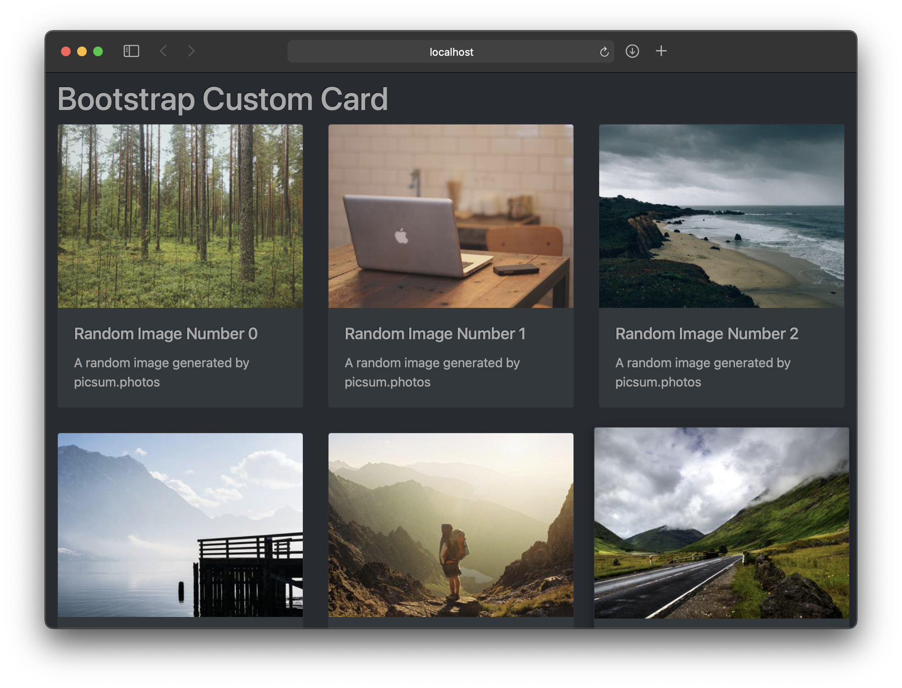

# custom-bootstrap-card

A custom card component based on Bootstrap 4
---



## Usage

In HTML head:
```html
<!-- link Bootstrap CSS [REQUIRED] -->
<link rel="stylesheet"
href="https://cdn.jsdelivr.net/npm/bootstrap@4.6.0/dist/css/bootstrap.css">

<!-- link for dark mode support [OPTIONAL] -->
<link rel="stylesheet"
href="https://cdn.jsdelivr.net/npm/bootsdark@latest/dist/bootsdark.min.css">
```
In HTML body:
```html
<div id="exampleCards" class="row tms-cards">
      <!-- cards will go here -->
</div>

<script type="module">
  import {addCard} from
    'https://cdn.jsdelivr.net/npm/custom-bootstrap-card@1.0.2/bootstrap-card.js';

  addCard({
    rowId: "exampleCards",
    imageUrl: "https://picsum.photos/400/300",
    imageAlt: "sample picsum image",
    title: "Random Image Number",
    text: "A random image from picsum.photos",
    href: "https://example.com"
  });
</script>
```
